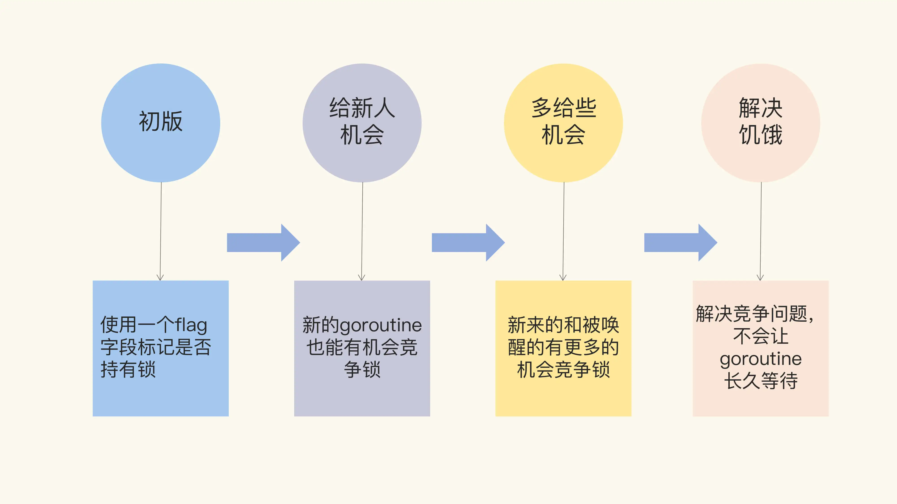

# Mutex实现及演进

- “初版”的 Mutex 使用一个 flag 来表示锁是否被持有，实现比较简单；

- 后来照顾到新来的 goroutine，所以会让新的 goroutine 也尽可能地先获取到锁，这是第二个阶段，我把它叫作“给新人机会”；
- 那么，接下来就是第三阶段“多给些机会”，照顾新来的和被唤醒的 goroutine；
- 但是这样会带来饥饿问题，所以目前又加入了饥饿的解决方案，也就是第四阶段“解决饥饿”。
- 

## 初版互斥锁

- 通过一个flag变量标记当前锁是否被某个goroutine持有

- flag为1代表被持有，其他竞争的goroutine只能等待

- flag为0就可以通过CAS（compare and swap）将这个flag置为1，标记锁被这个goroutine持有

  ```go
     // CAS操作，当时还没有抽象出atomic包
      func cas(val *int32, old, new int32) bool
      func semacquire(*int32)
      func semrelease(*int32)
      // 互斥锁的结构，包含两个字段
      type Mutex struct {
          key  int32 // 锁是否被持有的标识
          sema int32 // 信号量专用，用以阻塞/唤醒goroutine
      }
      
      // 保证成功在val上增加delta的值
      func xadd(val *int32, delta int32) (new int32) {
          for {
              v := *val
              if cas(val, v, v+delta) {
                  return v + delta
              }
          }
          panic("unreached")
      }
      
      // 请求锁
      func (m *Mutex) Lock() {
          if xadd(&m.key, 1) == 1 { //标识加1，如果等于1，成功获取到锁
              return
          }
          semacquire(&m.sema) // 否则阻塞等待
      }
      
      func (m *Mutex) Unlock() {
          if xadd(&m.key, -1) == 0 { // 将标识减去1，如果等于0，则没有其它等待者
              return
          }
          semrelease(&m.sema) // 唤醒其它阻塞的goroutine
      }    
  ```

- CAS:：将给定的值和一个内存中的值进行比较，如果是同一个值，就使用新的值替换内存地址中的值，这个操作是原子性的。

- CAS的参数：内存值val、预期值old、要修改的值new，当且仅当预期值old和内存值val相同时，才将内存值修改为new，否则什么都不做（通过一条汇编指令 CMPXCHG 实现）。最后返回现在的val值。

- 原子性：原子性保证这个指令总是基于最新的值进行计算，如果同时有其他线程已经修改这个值，那么CAS返回失败。

- Mutex包含两个字段

  - 字段 state：是一个 flag，用来标识这个排外锁是否被某个 goroutine 所持有，如果 key 大于等于 1，说明这个排外锁已经被持有；
  - 字段 sema：是个信号量变量，用来控制等待 goroutine 的阻塞休眠和唤醒。

- 调用Lock() 请求锁时，采用原子性的CAS操作对字段state加1

- 如果比较幸运，锁没有被别的 goroutine 持有，那么，Lock 方法成功地将 key 设置为 1，这个 goroutine 就持有了这个锁；

- 如果锁已经被别的 goroutine 持有了，那么，当前的 goroutine 会把 key 加 1，而且还会调用 semacquire 方法，使用信号量将自己休眠，等锁释放的时候，信号量会将它唤醒。

- 持有锁的 goroutine 调用 Unlock 释放锁时，它会将 key 减 1。如果当前没有其它等待这个锁的 goroutine，这个方法就返回了

- 如果还有等待此锁的其它 goroutine，那么，它会调用 semrelease 方法，利用信号量唤醒等待锁的其它 goroutine 中的一个，等待的goroutine是以FIFO排队的。

  ```go
  //go:linkname sync_runtime_SemacquireMutex sync.runtime_SemacquireMutex
  func sync_runtime_SemacquireMutex(addr *uint32, lifo bool, skipframes int) {
  	semacquire1(addr, lifo, semaBlockProfile|semaMutexProfile, skipframes, waitReasonSyncMutexLock)
  }
  
  //go:linkname sync_runtime_Semrelease sync.runtime_Semrelease
  func sync_runtime_Semrelease(addr *uint32, handoff bool, skipframes int) {
  	semrelease1(addr, handoff, skipframes)
  }
  ```

- **Unlock 方法可以被任意的 goroutine 调用释放锁，即使是没持有这个互斥锁的 goroutine，也可以进行这个操作。这是因为，Mutex 本身并没有包含持有这把锁的 goroutine 的信息，所以，Unlock 也不会对此进行检查。Mutex 的这个设计一直保持至今。**
- 因此要遵循“谁申请，谁释放”的原则
- Lock和Unlock最好成对出现
- 如果临界区只是方法中的一部分，为了尽快释放锁，还是应该第一时间调用 Unlock，而不是一直等到方法返回时才释放。
- 初版Mutex的问题：请求锁的 goroutine 会排队等待获取互斥锁。虽然这貌似很公平，但是从性能上来看，却不是最优的。因为如果我们能够把锁交给正在占用 CPU 时间片的 goroutine 的话，那就不需要做上下文的切换，在高并发的情况下，可能会有更好的性能。

## 给新人机会

- Mutex结构
```go
type Mutex struct {
  state int32
  sema  uint32
}


const (
  mutexLocked = 1 << iota // mutex is locked
  mutexWoken
  mutexWaiterShift = iota
)
```

- 字段state是一个复合型的字段，一个字段包含多个意义，这样可以通过尽可能少的内存来实现互斥锁。

  - 这个字段的第一位（最小的一位）来表示这个锁是否被持有，
  - 第二位代表是否有唤醒的 goroutine，
  - 剩余的位数代表的是等待此锁的 goroutine 数。

  ```go
     func (m *Mutex) Lock() {
          // Fast path: 幸运case，能够直接获取到锁
          if atomic.CompareAndSwapInt32(&m.state, 0, mutexLocked) {
              return
          }
  
          awoke := false
          for {
              old := m.state
              new := old | mutexLocked // 新状态加锁
              if old&mutexLocked != 0 {
                  new = old + 1<<mutexWaiterShift //等待者数量加一
              }
              if awoke {
                  // goroutine是被唤醒的，
                  // 新状态清除唤醒标志
                  new &^= mutexWoken
              }
              if atomic.CompareAndSwapInt32(&m.state, old, new) {//设置新状态
                  if old&mutexLocked == 0 { // 锁原状态未加锁
                      break
                  }
                  runtime.Semacquire(&m.sema) // 请求信号量
                  awoke = true
              }
          }
      }
  ```

  - 首先是通过 CAS 检测 state 字段中的标志，如果没有 goroutine 持有锁，也没有等待持有锁的 gorutine，那么可以直接获得锁。
  - 如果想要获取锁的 goroutine 没有机会获取到锁，就会进行休眠
  - 在锁释放唤醒之后，它并不能像先前一样直接获取到锁，还是要和正在请求锁的 goroutine 进行竞争。这会给后来请求锁的 goroutine 一个机会，也让 CPU 中正在执行的 goroutine 有更多的机会获取到锁，在一定程度上提高了程序的性能。
  - **新来的 goroutine 也有机会先获取到锁，甚至一个 goroutine 可能连续获取到锁，打破了先来先得的逻辑。但是，代码复杂度也显而易见。**

  ## 多给些机会

  - 如果新来的 goroutine 或者是被唤醒的 goroutine 首次获取不到锁，它们就会通过自旋（spin，通过循环不断尝试，spin 的逻辑是在runtime 实现的）的方式，尝试检查锁是否被释放。在尝试一定的自旋次数后，再执行原来的逻辑。
  - 对于临界区代码执行非常短的场景来说，这是一个非常好的优化。因为临界区的代码耗时很短，锁很快就能释放，而抢夺锁的 goroutine 不用通过休眠唤醒方式等待调度，直接 spin 几次，可能就获得了锁。

  ## 解决饥饿

  - 存在场景：因为新来的 goroutine 也参与竞争，有可能每次都会被新来的 goroutine 抢到获取锁的机会，在极端情况下，等待中的 goroutine 可能会一直获取不到锁，这就是饥饿问题。
  - 更新后Mutex 最重要的变化，就是增加饥饿模式。
  - 将饥饿模式的最大等待时间阈值设置成了 1 毫秒，这就意味着，一旦等待者等待的时间超过了这个阈值，Mutex 的处理就有可能进入饥饿模式，优先让等待者先获取到锁，新来的同学主动谦让一下，给老同志一些机会。
  - 饥饿模式，可以避免把机会全都留给新来的 goroutine，保证了请求锁的 goroutine 获取锁的公平性，对于我们使用锁的业务代码来说，不会有业务一直等待锁不被处理。

  ## 思考题

  - 目前 Mutex 的 state 字段有几个意义，这几个意义分别是由哪些字段表示的？
    - state字段为int32
    - 第一个bit表示锁的状态
    - 第二个bit表示是否有协程被唤醒
    - 第三个bit表示是否为饥饿模式
    - 剩余bit表示等待锁的协程的个数
  - 等待一个 Mutex 的 goroutine 数最大是多少？是否能满足现实的需求？
    - 2^(32-3)个